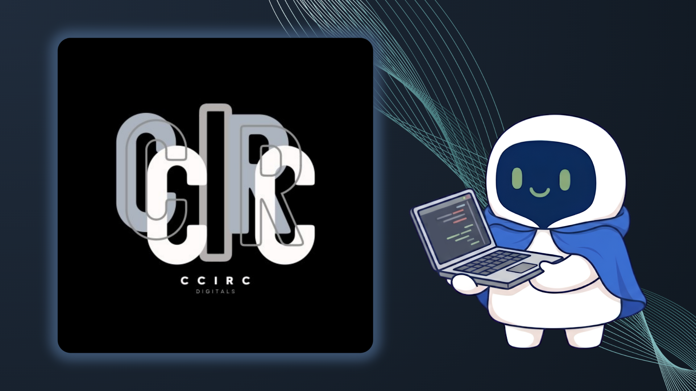

# CCIRC Open Resources

  

**精誠中學資訊讀書會 ·** ***C**hing **C**heng high school **I**nformation **R**eading **C**lub*

> *Learn to code. Think deeper. Build together.*

---

> Free and open educational resources created by CCIRC.

**CCIRC Open Learning Resources** is a collection of free educational
resources created by the Ching Cheng Information Reading Club
(CCIRC).

Our goal is simple:

> Make programming concepts easier to understand, visualize,
> and share.

---

## 📚 Resources

### C++ STL Visual Guide

Visual explanations of commonly used C++ Standard Library
containers and concepts.

| # | Topic | Chinese |
|---|---|---|
| 01 | `vector` | 動態陣列 |
